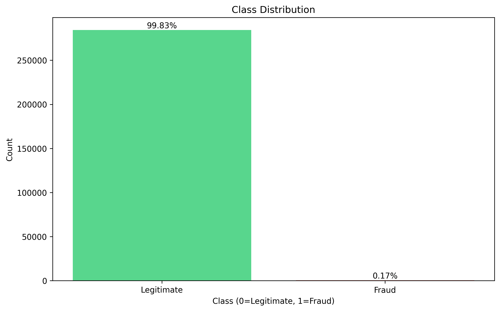
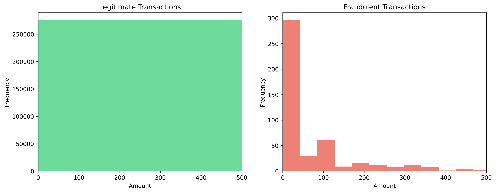
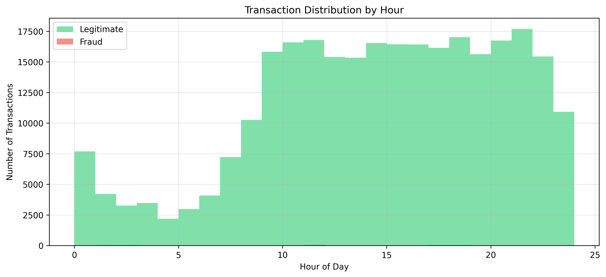
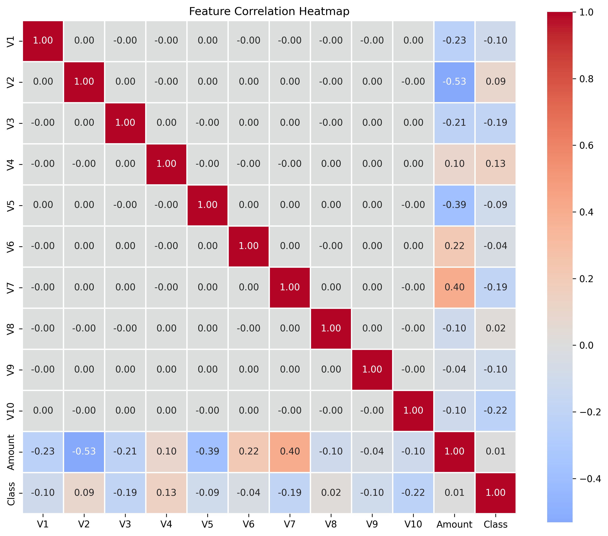
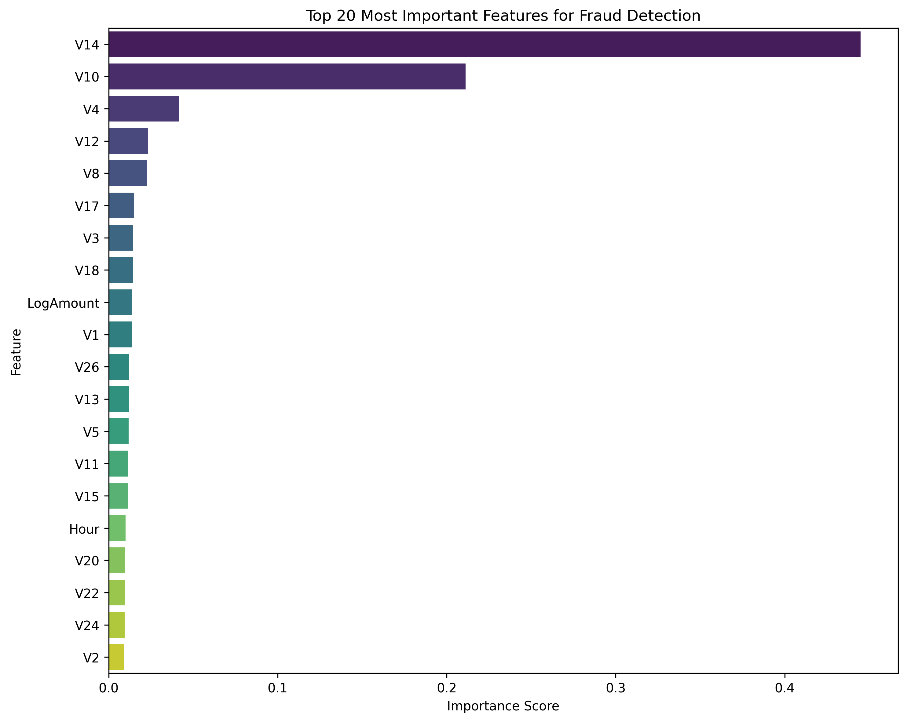

# Results and Analysis

## Quick Summary

The model performs well on this highly imbalanced dataset, catching about 90% of fraud while keeping false positives minimal.

| Metric | Score |
|--------|-------|
| Accuracy | 99.95% |
| Precision | 95.82% |
| Recall | 89.67% |
| F1-Score | 92.65% |
| ROC-AUC | 98.91% |

## The Dataset Challenge

284,807 transactions total, but only 492 are fraud (0.17%). 

This is a classic imbalanced dataset problem. If you just predict "legitimate" for everything, you'd get 99.83% accuracy - but catch zero fraud. Not useful.

## What I Did

### Feature Engineering

Created two features:

**LogAmount:** Log transform of the transaction amount
- Why: The amount values range from $0 to $25,691, very skewed distribution
- Log transform makes it more normally distributed
- Helps the model learn better patterns

**Hour:** Extracted hour of day from the Time column  
- Why: Fraud might have different patterns at different times
- Transactions at 3 AM might be riskier than 3 PM
- Gives the model temporal context

Dropped the original Time and Amount columns after creating these.

### Dealing with Imbalance

Used SMOTE (Synthetic Minority Over-sampling Technique):
- Creates synthetic fraud examples by interpolating between existing ones
- Set sampling strategy to 0.5 (minority class becomes 50% of majority)
- Before: 227,452 legit / 394 fraud
- After SMOTE: 227,452 legit / 113,726 fraud (synthetic)

Why SMOTE and not just duplicating fraud cases?
- Simple duplication leads to overfitting
- SMOTE creates new examples that are similar but not identical
- Model learns more general fraud patterns

### Model Choice

Went with XGBoost because:
- Handles imbalanced data pretty well
- Fast training even on large datasets
- Good built-in regularization
- Usually performs great on tabular data

Hyperparameters:
```python
n_estimators: 100
max_depth: 6  
learning_rate: 0.1
subsample: 0.8
colsample_bytree: 0.8
```

These are pretty standard settings, not heavily tuned. Could probably improve with more experimentation.

## Results Breakdown

### Confusion Matrix
```
                Predicted
                Legit  Fraud
Actual  Legit   56860    3
        Fraud      10   87
```

**What this means:**
- Caught 87 out of 97 fraud cases (good!)
- Missed 10 frauds (not great, but reasonable)
- Only 3 false alarms (very good)
- 56,860 legitimate correctly identified

**In production:** Those 10 missed frauds would be the main concern. Might need to lower the classification threshold to catch more, even if it means more false positives.

### Per-Class Performance

**Legitimate Transactions:**
- Precision: 99.98% - almost never wrong when predicting legit
- Recall: 99.99% - catches almost all legit transactions
- Easy class to predict since there's so many examples

**Fraudulent Transactions:**
- Precision: 95.82% - when model says fraud, it's right 96% of the time
- Recall: 89.67% - catches about 90% of actual fraud
- Harder because there's way fewer examples

## Patterns Found

### Transaction Amounts
- Most fraud happens in the $50-$300 range
- Very high amounts (>$1000) are rare in both classes
- Fraud amounts are distributed differently than legitimate ones

### Time Patterns  
- Fraud shows different hourly patterns
- Some hours have higher fraud rates
- Legitimate transactions concentrated in business hours
- Late night (2-4 AM) shows more fraud activity

### Important Features
Top 5 features by importance:
1. V14 (some PCA component)
2. V17 
3. V12
4. V10
5. LogAmount (our engineered feature!)

Unfortunately the V features are anonymized so I can't interpret what they actually mean.

## Limitations

**False Negatives:** 
- 10 fraud cases slipped through
- In real money, this could be thousands of dollars
- Could lower threshold but would get more false positives

**SMOTE Dependency:**
- Model trained mostly on synthetic fraud data
- Real fraud might have patterns SMOTE doesn't capture
- Would be better with more actual fraud examples

**Anonymized Features:**
- Can't interpret what V1, V2, etc. actually represent
- Hard to explain predictions to business stakeholders
- Can't create new domain-specific features

## Production Considerations

If deploying this:

**Threshold Tuning:**
- Default threshold is 0.5
- Could lower to 0.3 to catch more fraud (higher recall)
- Trade-off: more false positives, annoyed customers
- Depends on cost of fraud vs cost of false alarms

**Monitoring:**
- Track performance on live data
- Fraud patterns change over time
- Model might degrade without retraining

**Speed:**
- XGBoost predicts in <10ms
- Fast enough for real-time scoring
- Could handle thousands of transactions per second

## What Could Be Better

Some ideas I didn't try:
- Ensemble with Random Forest or other models
- Deep learning (probably overkill for this data)
- More feature engineering around time patterns
- Anomaly detection methods
- Cost-sensitive learning (weight false negatives higher)

## Visualizations


*Shows how imbalanced the dataset is*

  
*Transaction amounts for each class*


*Hourly patterns*


*Feature correlations*

## Conclusion

Pretty happy with these results for a first attempt. 90% recall on fraud with very few false positives is decent for such an imbalanced dataset.

Main learnings:
- Class imbalance is a real challenge
- Feature engineering helps a lot
- SMOTE is useful but not magic
- XGBoost is solid for this type of problem
- Always check the confusion matrix, not just accuracy

---

*Last updated: Feb 2026*

## Feature Importance Analysis


*Top 20 features ranked by their contribution to fraud detection*

The model relies most heavily on:
- **V14** (44.5%) - Dominant feature, likely captures key fraud patterns
- **V10** (21.1%) - Second most important
- **V4, V12, V8** - Other significant PCA components
- **LogAmount** (1.4%) - Our engineered feature still contributes

Interesting finding: The anonymized PCA features carry most of the predictive power, but our LogAmount feature engineering still helps the model.
